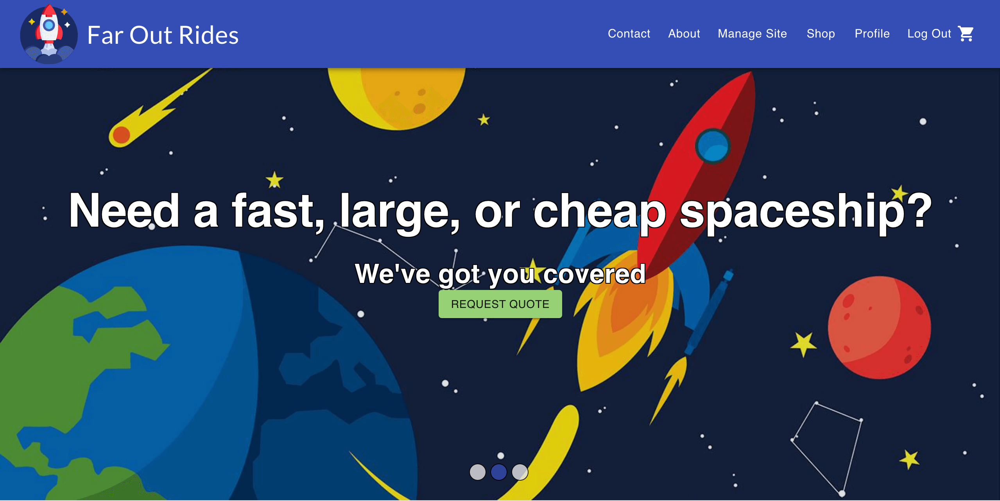

# ReactGraphQLTemplate
A fully-functioning template for building modern, maintainable websites.




## Website Features
- Modern design, with automatic dark mode
- Mobile-friendly
- Credentials and restricted pages
- Ability to send emails/texts
- Ability to upload images/files
- Search Engine Optimization (SEO) techniques


## Development stack
| Dependency  | Purpose  |  Version  |
|---|---|---|
| [ReactJS](https://reactjs.org/)  | UI  |  `^17.0.2` |
| [MaterialUI](https://material-ui.com/)  | UI Styling  |  `^5.0.0-beta.0`  |
| [Apollo](https://www.apollographql.com/)  | API (GraphQL) |  `^2.25.0` |
| [Prisma](https://www.prisma.io/)  | Easier GraphQL building |  `^2.30.2`  |
| [ExpressJs](https://expressjs.com/)  |  Backend Server  | `^4.17.1` |
| [PostgreSQL](https://www.postgresql.org/)  | Database  | `postgres:13` |
| [Redis](https://redis.io/) | Task Queueing | `redis` |


## How to start  

### 1. Prerequisites  
Before developing a website from this template, make sure you have the following installed:   
1. *Windows only*: [Windows Terminal](https://www.microsoft.com/store/productId/9N0DX20HK701)
2. *Windows only*: [Ubuntu](https://www.microsoft.com/store/productId/9PNKSF5ZN4SW)
3. [Docker](https://www.docker.com/). On Windows, Docker will guide you through enabling Windows Subsystem for Linux (WSL)
4. [VSCode](https://code.visualstudio.com/) *(also look into enabling Settings Sync)*    

**Note 1**: On Windows, NPM and Yarn should be installed from Ubuntu directly.  
**Note 2**: If you want to develop on a remote server (e.g. computer too slow, don't have admin privileges for Docker), you can follow the [instructions for setting this up](https://github.com/MattHalloran/ReactGraphQLTemplate/blob/remote-development/README.md#4-set-up-remote-development-if-you-cant-develop-locally). If this is the case, the only prerequisite you need is VSCode.

### 2. Configure for WSL (Windows only) 
VSCode and Docker require additional setup on Windows, since you must use the Windows Subsystem for Linux (WSL). First, make sure the WSL status indicator can appear in VSCode:   
1. Open VSCode  
2. Right click the status bar, and make sure "Remote Host" is checked

Next, make sure Docker's WSL integation uses the Ubuntu distro downloaded in step 1:  
1. Open Docker Desktop
2. Go to Resources -> WSL Integration  
3. Select the Ubuntu distro
4. Apply and restart

The next steps should not be needed if you use WSL correctly. But if you end up changing things without using WSL, complete the following:   
1. Change the default terminal to support Unix commands:  
    1. Enter `CTRL+SHIFT+P` to open the Command Palette
    2. Search and select `Terminal: Select Default Profile`
    3. Change the terminal to `Git Bash`     
2. Make sure that the project's script files aren't converted to Windows line endings. To accomplish this:  
    1. Open a `Git Bash` terminal in VSCode (should be the default now)
    2. Enter `git config --global core.autocrlf false`. If you already downloaded the project, you may need to delete it and redownload. Alternatively, I'm sure you could find a script online that converts file line endings.  
    
### 3. Set up Remote Development (if you can't develop locally)  
A more detailed guide (minus step 1) can be [found here](https://www.digitalocean.com/community/tutorials/how-to-use-visual-studio-code-for-remote-development-via-the-remote-ssh-plugin).
1. Follow the [deployment steps](https://github.com/MattHalloran/ReactGraphQLTemplate#deploying-project) to learn how to host a VPS and set it up correctly  
2. Set up a pair of SSH keys. Make note of the file location that the keys are stored in
1. In VSCode, download the [Remote Development extension](https://code.visualstudio.com/docs/remote/remote-overview)  
2. Enter `CTRL+SHIFT+P` to open the Command Palette  
3. Search and select `Remote-SSH: Open Configuration File...`  
4. Edit configuration file to contain an entry with this format:  
    ```
    Host <any_name_for_remote_server>
        HostName <your_server_ip_or_hostname>
        User <your_username>
        IdentityFile <ssh_keys_location>
    ```
    **Note 1**: You can now reference your host by the name you chose, instead of its IP address  
    **Note 2**: `User` is likely `root`  
5. Open Command Palette again and select `Remote-SSH: Connect to Host...`   
6. A new VSCode terminal should open. Answer the questions (e.g. server type, server password), and you should be connected!  
7. Open the `Extensions` page in VSCode, and download the extensions you want to use

### 4. Download this repository
In the directory of your choice, enter `git clone https://github.com/MattHalloran/ReactGraphQLTemplate`. On Windows, make sure this is done from an Ubuntu terminal in Windows Terminal. If the code is stored on the Windows file system, then docker will be **extremely** slow - and likely unusable.  

To open the project from the command line, enter `code <PROJECT_NAME>` from the directory you cloned in, or `code .` from the project's directory.

### 5. Install packages
1. `cd ReactGraphQLTemplate`  
2. `chmod +x ./scripts/* && ./scripts/setup.sh`
4. Restart code editor  

**Note:** The global dependencies in `setup.sh` are global because they're either used by a `Dockerfile` or `package.json`. If you want to make sure the dependency versions are correct, you should check those files

### 6. Set environment variables  
1. Edit environment variables in [.env-example](https://github.com/MattHalloran/ReactGraphQLTemplate/blob/master/.env-example)
2. Rename the file to .env

### 7. Business data
Edit the file `assets/public/business.json` to match your business's data.

### 8. Docker
By default, the docker containers rely on an external network. This network is used for the server's nginx docker container. During development, there is no need to run an nginx container. Instead, you can enter: `docker network create nginx-proxy`   
Once the docker network is set up, you can start the entire application by entering in the root directory: `docker-compose up --build --force-recreate -d`

### 9. Enter website information
This project is set up so an admin can update various aspects without needing to mess with servers/code. To log in as an admin, use the admin credentials set in the `.env` file.  
Once you are logged in, you should see a navigation option for "manage site". This includes links and descriptions to all of the admin functions. For inventory upload, there is an file that works with the example database, located in [assets/private](assets/private).


## Open Graph Tags
Open Graph is a metadata format that describes how your website should be shown when shared on social media. This data is set in the header, and can be edited at `packages/ui/public/index.html`. For more information, [here](https://developers.facebook.com/docs/sharing/webmasters/) is a guide from Facebook.


## Common commands
- Start: `docker-compose up -d`
- Stop: `docker-compose down`
- Force stop all containers: `docker kill $(docker ps -q)`
- Delete all containers: `docker system prune --all`
- Delete all containers and volumes: `docker system prune --all --volumes`
- Full deployment test (except for Nginx, as that's handled by a different container): `docker-compose down && docker-compose up --build --force-recreate`
- Rebuild with fresh database: `docker-compose down && rm -rf "${PROJECT_DIR}/data/postgres" && docker-compose up --build --force-recreate`
- Check logs for a docker container: `docker logs <container-name>`


## Linting
The ESLint VSCode extension is great for catching errors and warnings. It can be configured with an `.eslintrc` file.


## Database migrations
Database migrations are handled by Prisma. Full documentation can be found [here](https://www.prisma.io/docs/concepts/components/prisma-migrate)

## Database seeding
Database seeding is also handled by Prisma, with full documentation [here](https://www.prisma.io/docs/guides/database/seed-database).


## Non-database storage
It is generally recommended to store data on an external server, but for smaller projects, local upload/download can also be useful. In this project, admins have a wide array of customization features, such as changing the images in a hero banner. Uploaded data is stored at `<project_dir>`/assets


## Email setup
It is often useful to send and receives emails with the website's address. Instructions to set that up can be found [here](/docs/MessengerSetup.txt)


## Favicons
A favicon is the image displayed in a browser's tab window. It also has other uses, such as being the icon displayed if the site is added to the home screen on a phone. There are a lot of different formats out there, so it's easiest to use a site like [realfavicongenerator](https://realfavicongenerator.net/) to guide you through this process. All you need is an svg file of your desired image (usually your company logo).

Favicons should be placed in `packages/ui/public`. The link and meta tags should be added to `packages/ui/public/index.html`. After your favicon files are in the correct location, if you have a `site.manifest` or `manifest.json` file, make sure you have the following fields to qualify as a Progressive Web Application (PWA):  
1. `name` - Name of application in install dialog and Chrome Web Store. Maximum 45 characters  
2. `short_name` - Short version of application name. Maximum 12 characters  
3. `display` - either `fullscreen`, `standalone`, `minimal-ui`, or `browser`
4. `scope` - usually `/`
4. `start_url` - usually `/`  

See [here](https://web.dev/add-manifest/) for more information on manifest fields.

If you are planning to support Progressive Web Apps (PWA), then you should also have a square version of your logo referenced in the manifest file. [Here](https://maskable.app/editor) is a useful site for checking how your image looks with different masks.


## Theming
Picking the correct colors for your site can be easy or complicated, depending on how deeply you want to go into it (you could use color theory, for example). You also have to make sure that your theme's colors are different enough from each other to be distinguisable. I use [this color tool](https://material.io/resources/color/#!/?view.left=0&view.right=0) to create a solid starting point. The site's theme is set in [packages/ui/src/utils/theme.ts](packages/ui/src/utils/theme.ts).

By default, this site automatically sets dark or light theme depending on your browser's settings. This is accomplished in [packages/ui/src/App.ts](packages/ui/src/App.ts).


## Custom fonts
The easiest way to use custom fonts is by using [Google Fonts](https://fonts.google.com/). Once a font is selected, you should see some html needed for the font to be loaded. This can be pasted into [packages/ui/public/index.html](packages/ui/public/index.html). Then the font can be applied with the font-family CSS tag, as also shown on Google Fonts.

Alternatively, you can supply your own fonts. Using a site such as [1001 Fonts](https://www.1001fonts.com/) allows you to download a `.woff` or `.woff2` file for your desired font. This can be placed in [packages/ui/src/assets/fonts](packages/ui/src/assets/fonts), and registered in the global css section of [packages/ui/src/App.ts]() like so:  
```javascript
    import SakBunderan from './assets/fonts/SakBunderan.woff';
    ...
    "@global": {
        ...
        '@font-face': {
            fontFamily: 'SakBunderan',
            src: `local('SakBunderan'), url(${SakBunderan}) format('truetype')`,
            fontDisplay: 'swap',
        }
    },
```

Then, when you need to use the font, you can reference it like this:

```javascript
    navName: {
        ...
        fontSize: '3.5em',
        fontFamily: `SakBunderan`,
    },
```

When using a custom font, it is a good idea to compress it using [Font Squirrel](https://www.fontsquirrel.com/tools/webfont-generator). In web development, size matters😉

## GraphQL
[GraphQL](https://graphql.org/) is a query language for APIs. It is a faster, understandable, and modernan alternative to REST APIs.

### GraphQL debugging
GraphQL syntax errors are notoriously hard to debug, as they often do not give a location. Luckily, this project is structured in a way that allows these issues to be tracked down. 

In the [schema directory](packages/service/src/schema), the GraphQL resolvers are split up into individual files, which are stitched together in the [index file](packages/service/src/schema/index.ts). In this file, the `models` object is used to combine all of the individual schemas. If you make this an empty array, you can comment out imports until the problem goes away. This allows you to pinpoint which schema file is causing the error. Common errors are empty parentheses (ex: `users():` instead of `users:`) and empty brackets.

### GraphQL TypeScript generation
GraphQL is already typed, but it unfortunately doesn't play well with TypeScript's typing system. Instead of creating TypeScript types yourself (which is tedious), they can be generated automatically from an endpoint. This requires the backend server to be running.

#### Server TypeScript generation
1. Start project locally **in development mode** (if ui is not runnable, that's fine. We just need a working server) - `docker-compose up -d`
2. `cd packages/server`
3. `yarn graphql-generate`

#### UI TypeScript generation
1. Start project locally **in development mode** (if ui is not runnable, that's fine. We just need a working server) - `docker-compose up -d`
2. `cd packages/ui` 
3. `yarn graphql-generate`  

See [this video](https://youtu.be/Tw_wn6XUfnU) for more details.


## Local testing on another device
Mobile devices can be simulated in Chrome Dev Tools, so testing is usually only done on your main development computer. However, if you'd still like to test on a different device, it will unfortunately not work out-the-box. This is because development uses the `localhost` alias. Your device will not be able to resolve this to the correct IP address (ex: `192.168.0.2`), so you have to change it manually. There are 2 places where this must be done: (1) [packages/server/src/index.ts](https://github.com/MattHalloran/ReactGraphQLTemplate/blob/master/packages/server/src/index.ts); and (2) [packages/shared/src/apiConsts.ts](https://github.com/MattHalloran/ReactGraphQLTemplate/blob/master/packages/shared/src/apiConsts.ts).


## Testing performance, accessibility, and SEO
[Lighthouse](https://developers.google.com/web/tools/lighthouse) is an open-source tool for testing any website's (even localhost) performance, accessibility, and Search Engine Optimization (SEO). This can be accessed in Chrome Dev Tools. The tool generates a report in less than a minute, which gives plenty of details and resources that you can look through. This website template is designed to maximize Lighthouse performance by default, but your specific needs may vary. Some places to look at are:  
- Compress static images - The easiest way to reduce request payloads is by compressing static images. This can be done on many sites, such as [this one for PNGs](https://compresspng.com/) and [this one](https://jakearchibald.github.io/svgomg/) for SVGs.
- [Sitemap.ts](packages/ui/src/Sitemap.ts) and [Routes.ts](packages/ui/src/Routes.ts) - Automatically generates a sitemap for your website. This helps web crawlers determine which pages are important, and what the pages contain. See [this article](https://developers.google.com/search/docs/advanced/sitemaps/overview) for more information
- Remove unused dependencies - The easiest way I've found to discover unused dependencies is with [depcheck](https://www.npmjs.com/package/depcheck):    
    1. In project's root directory, enter `yarn global add depcheck`  
    2. `depcheck` or `npx depcheck`  
    3. Repeat in each package (packages/server, packages/shared, packages/ui)  
Before removing packages, please make sure that depcheck was correct. If you are only using the package in a Dockerfile, for example, it may not catch it!
- Remove unused components and pages - Every byte counts with web responsiveness! One method for finding unused code is to use [ts-unused-exports](https://github.com/pzavolinsky/ts-unused-exports).
- Peek inside code bundles - Seeing what's inside the code bundles can help you determine what areas of the code should be lazy loaded, and what is taking the most space. To do this:  
    1. `cd packages/ui ` 
    2. `yarn build`
    3. `yarn analyze`

**NOTE**: When testing for performance, make sure you are running a production build. This can be set with `NODE_ENV` in the .env file. If you would like to test performance locally, make sure the `SERVER_LOCATION` variable is set to 'local'. Just be mindful that certain performance features (such as cache policy) may be handled by Nginx, so they won't be available locally.


## Progressive Web App (PWA)
A PWA is a website that can be installed on mobile devices. These don't have quite the same functionality as native apps, but hopefully one day they will. To make your website PWA-compatable, perform an audit on Lighthouse. Then, follow the steps it provides. **Make sure `NODE_ENV` is set to `production` when testing PWA.**

One common issue that arises here is "Manifest doesn't have a maskable icon". Clicking on it provides more information, but the gist is that you need a square version of your project's logo. See [here](https://w3c.github.io/manifest/#icon-masks) for how it should be designed.


## Trusted Web Activity (TWA)
A trusted web activity is a PWA that runs natively on Android devices. They can also be listed on the Google Play store, making them almost identical to traditional apps. If this sounds interesting to you, make sure that the `packages/ui/public/site.manifest` or `packages/ui/public/manifest.json` file has the following data:  
1. orientation
2. screenshots (displayed in the store)  
3. 
, along with everything mentioned in the Favicons and PWA sections of this guide. All known manifest fields can be found [here](https://developer.mozilla.org/en-US/docs/Web/Manifest/categories).

Once that is complete, you can use the [PWABuilder tool](https://www.pwabuilder.com/) to generate other required files and receive further instructions.


## Brave Rewards
Brave Rewards is a service that allows users of the Brave browser to earn Basic Attention Tokens (BAT) for viewing ads. Enabling this on your website will also allow you to earn BAT. The ads appear as a small popup in the bottom right corner of the browser. To set this up:  
1. Sign up your website (and your socials if you'd like) [here](https://publishers.basicattentiontoken.org/).
2. On your website's server (see *Deploying Project* section to set this up), cd to `packages/ui/build` in your project's directory.
3. `vim .well-known/brave-rewards-verification.txt`
4. Paste the text given in step 1 into the file, and save.


## Deploying project
Currently, the cheapest way to deploy a web project seems to be through VPS hosting. [Here](https://www.digitalocean.com/community/tutorials/how-to-set-up-an-ubuntu-20-04-server-on-a-digitalocean-droplet) is an example of how to do this on DigitalOcean. Instead of a plain Ubuntu server, however, it is easier to install one that already contains Docker.


### 1. Set up DNS
The site can be accessed by the VPS's IP address, but in most cases you'll want to associate the server with a domain name. There are many places to buy domains, but I use [Google Domains](https://domains.google)

Once you buy a domain, you must set up the correct DNS records. This can be done through the site that you bought the domain from, or the site that you bought the VPS from. [Here](https://www.youtube.com/watch?v=wYDDYahCg60) is a good example. **Note**: DNS changes may take several hours to take effect

### 2. Set up VPS - Reverse proxy
The VPS you'll be running this website on must be configured to handle website traffic. This is done through Nginx https://olex.biz/2019/09/hosting-with-docker-nginx-reverse-proxy-letsencrypt/

I've created [a project that automates this process](https://github.com/MattHalloran/NginxSSLReverseProxy#getting-started).

### 3. Set up VPS - Main code
1. `cd ~`
2. `git clone ${PROJECT_URL}`
3. `cd ${PROJECT_NAME}`
4. Edit .env variables
5. **Make sure that the urls in `packages/ui/public/index.html` point to the correct website**
6. `chmod +x ./scripts/*`
7. `docker-compose up -d`
